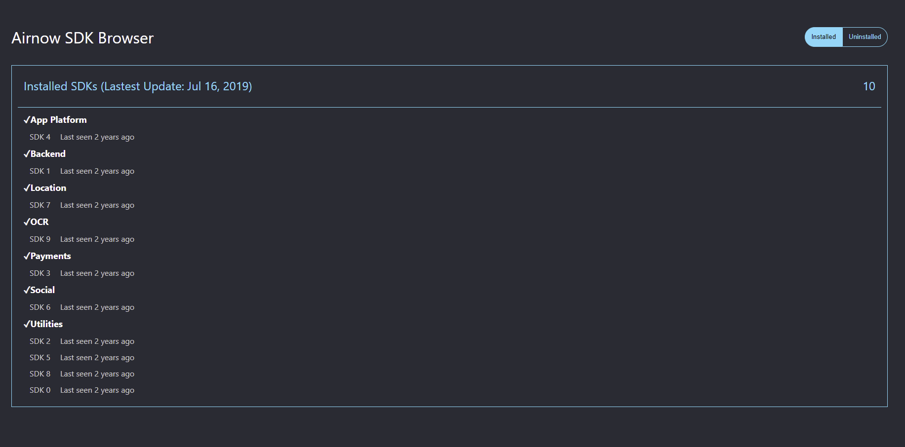

# SDK Browser

This is the simple application that lists installed or uninstalled sdks

<p align="center">
    
</p>

## How to use
1. Clone the repo in your local
    ``` 
    git clone https://github.com/FrozenIce0617/React-SDK-Browser.git
    ```

2. This project is bootstrapped by `create-react-app`
    
    in the root directory
    ```
    yarn or yarn install
    ```
    ```
    yarn start
    ```


